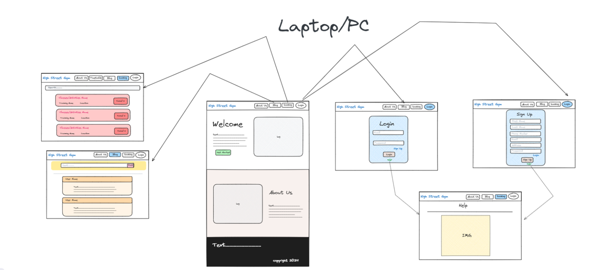

# High Street Gym

A modern, responsive web application for High Street Gym, offering features such as user authentication, activity booking, and a blog system.

Wireframe:
PC/Laptop-

Mobile-


## 🏋️ Features

- **User Authentication System**: Sign up and login functionality
- **Activity Booking**: Browse and book various fitness activities 
- **Blog System**: Read and post blogs related to fitness
- **Responsive Design**: Fully responsive across all device sizes

## 📋 Table of Contents

- [Technology Stack](#technology-stack)
- [Installation](#installation)
- [Usage](#usage)
- [Project Structure](#project-structure)
- [API Routes](#api-routes)
- [Future Enhancements](#future-enhancements)
- [Contributing](#contributing)
- [License](#license)

## 🛠️ Technology Stack

- **Frontend**: HTML, CSS, JavaScript
- **Server-side Rendering**: EJS (Embedded JavaScript templates)
- **Backend**: Node.js, Express.js
- **Database**: MySQL
- **Authentication**: bcryptjs, express-session
- **Libraries**: Bootstrap
- **Icons**: Boxicons

## 🔧 Installation

1. Clone the repository:
   ```bash
   git clone https://github.com/your-username/high-street-gym.git
   cd high-street-gym
   ```

2. Install dependencies:
   ```bash
   npm install
   ```

3. Set up your MySQL database (create schema and tables as required)

4. Start the server:
   ```bash
   # Development mode with auto-reload
   npm run dev
   
   # Production mode
   npm run start
   ```

5. Access the application at `http://localhost:8080`

## 🚀 Usage

1. Navigate to the homepage to explore gym services and information
2. Sign up or log in to access user features
3. Browse available activities on the booking page
4. Read or contribute to the fitness blog

## 📁 Project Structure

```
high-street-gym/
├── controllers/           # Route controllers
│   ├── activities.js      # Activity-related routes
│   ├── blogs.js           # Blog-related routes
│   └── users.js           # User authentication routes
├── static/                # Static assets
│   ├── CSS/               # Stylesheets
│   ├── img/               # Images
│   └── video/             # Video files
├── views/                 # EJS templates
│   ├── partials/          # Reusable template parts
│   │   ├── head.ejs       # Common head content
│   │   ├── header.ejs     # Navigation header
│   │   └── footer.ejs     # Common footer
│   ├── blogs.ejs          # Blog page template
│   ├── index.ejs          # Home page template
│   ├── search_activity.ejs # Activities page template
│   ├── user_login.ejs     # Login page template
│   └── user_signin.ejs    # Registration page template
├── server.js              # Express application setup
├── package.json           # Dependencies and scripts
└── README.md              # Project documentation
```

## 🔄 API Routes

- **GET /**:  Redirects to index page
- **GET /index**: Renders the homepage
- **GET /search_activity**: Renders the activity search page
- **GET /blogs**: Renders the blog page
- **GET /user_login**: Renders the login page
- **GET /user_signin**: Renders the registration page
- **POST /user_login**: Processes login form submission
- **POST /user_signin**: Processes registration form submission

## 🔮 Future Enhancements

- Implement actual database connectivity for users, activities, and blogs
- Add admin dashboard for gym management
- Implement payment integration for activity bookings
- Add user profiles with fitness tracking
- Create a mobile app using this API as a backend

## 👥 Contributing

1. Fork the repository
2. Create your feature branch (`git checkout -b feature/amazing-feature`)
3. Commit your changes (`git commit -m 'Add some amazing feature'`)
4. Push to the branch (`git push origin feature/amazing-feature`)
5. Open a Pull Request

## 📄 License

This project is licensed under the MIT License - see the LICENSE file for details.

## 📧 Contact

Chun-Huan Lee - vincent741516899@gmail.com
